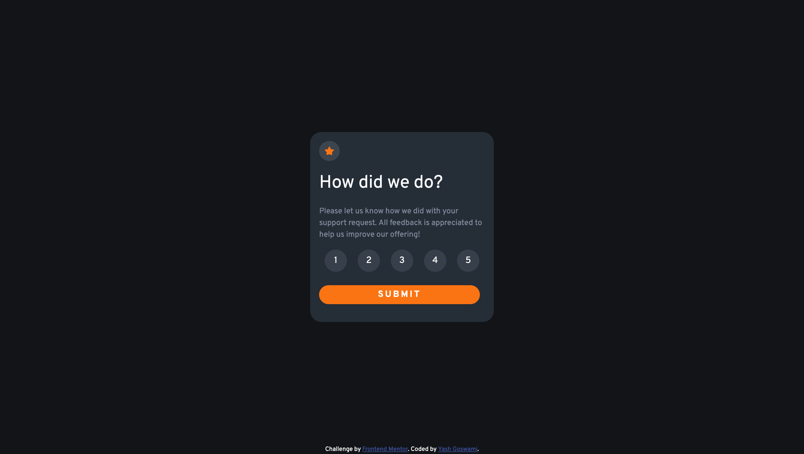
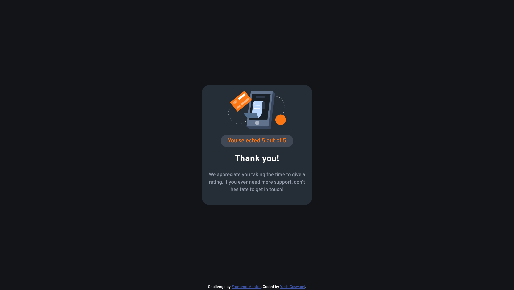

# Frontend Mentor - Interactive rating component solution

This is a solution to the [Interactive rating component challenge on Frontend Mentor](https://www.frontendmentor.io/challenges/interactive-rating-component-koxpeBUmI). Frontend Mentor challenges help you improve your coding skills by building realistic projects.

## Table of contents

- [Overview](#overview)
  - [The challenge](#the-challenge)
  - [Screenshot](#screenshot)
  - [Links](#links)
- [My process](#my-process)
  - [Built with](#built-with)
  - [What I learned](#what-i-learned)
  - [Continued development](#continued-development)
  - [Useful resources](#useful-resources)
- [Author](#author)
- [Acknowledgments](#acknowledgments)

## Overview

### The challenge

Users should be able to:

- View the optimal layout for the app depending on their device's screen size
- See hover states for all interactive elements on the page
- Select and submit a number rating
- See the "Thank you" card state after submitting a rating

### Screenshot




### Links

- Solution URL: [Solution Link](https://github.com/Yash-devasp/frontendmentor-interactive-rating-component)
- Live Site URL: [Site Link](https://yash-devasp.github.io/frontendmentor-interactive-rating-component/)

## My process

### Built with

- Semantic HTML5 markup
- CSS custom properties
- Flexbox
- CSS Grid
- Mobile-first workflow
- javascript

### What I learned

I got to learn more about grids and javascript. As this is my first javascript project so this challenge help me get to know how interactivity is important for a website.

To see how you can add code snippets, see below:

```js
span.addEventListener("click", (e) => {
  span.classList.toggle("active");
  currActive = span.innerText;
});
```

### Continued development

I would continue on with my journey on the javascript and will carry on with similar projects for better understanding;

### Useful resources

- [Javascript info](https://javascript.info) - This helped me to get down with the basics of javascript.
- [The net ninja](https://www.youtube.com/c/TheNetNinja) - This is an amazing youtube channel which helped me understand javascript. I'd recommend it to anyone new learning this language.

## Author

- Frontend Mentor - [@Yash-devasp](https://www.frontendmentor.io/profile/Yash-devasp)
- Twitter - [@yashdevasp](https://twitter.com/yashdevasp)

## Acknowledgments

I would like to thank Kevin Powell for intrducing me to this lovely community of frontend mentor. Thanks to everyone who helped me through the process.
